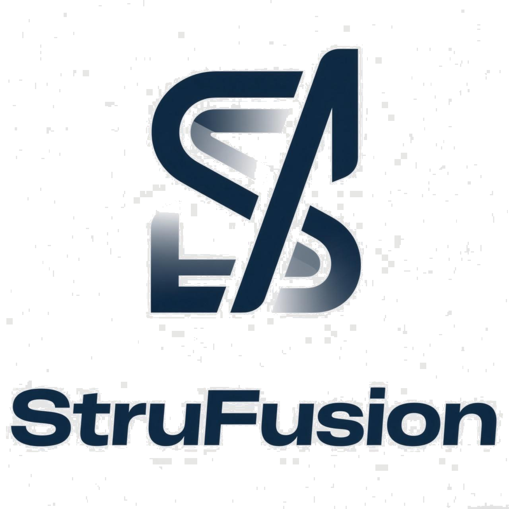
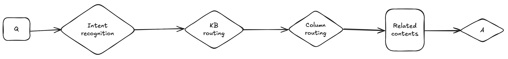

  

[English](README_en.md) | 简体中文

*这个项目是[simplekb](https://github.com/guchengxi1994/simplekb)的重构*

### 介绍

我一直觉得，非结构化数据的处理，离不开结构化思维。一个文档，总有（用户关心的）重点。于是，我们将非结构化数据的重点提取出来，变成结构化数据，让非结构化数据能够更方便的比较，聚合，并且，能够像结构化数据一样脱敏，分享。
正好RAG是一个数据清洗+检索流程，所以基于以上思维做了这个项目。

### 流程

**1.内容提取**

**2.问答**

