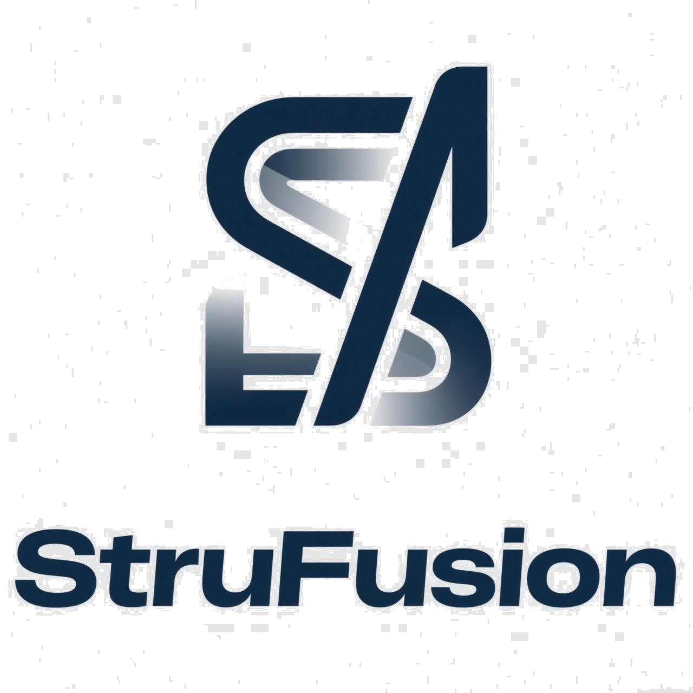
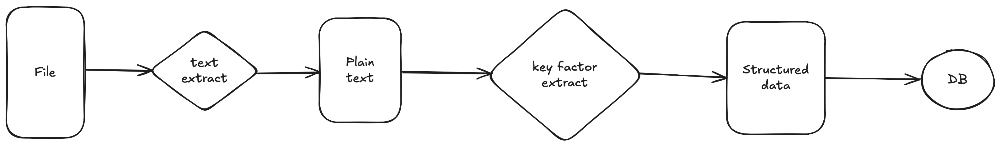
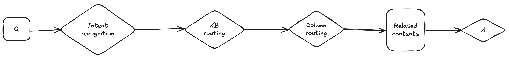

  

English | [简体中文](README.md)

*This project is a refactored version of [simplekb](https://github.com/guchengxi1994/simplekb)*

### Introduction

I’ve always believed that handling unstructured data requires structured thinking. Every document contains key points that users care about. So, we extract these key elements from unstructured data and convert them into structured data. This makes unstructured data easier to compare, aggregate, and even anonymize and share—just like structured data.

RAG happens to be a process that involves data cleaning and retrieval. With that in mind, I built this project based on the above philosophy.

### Workflow

**1. Content Extraction**

**2. Question Answering**

